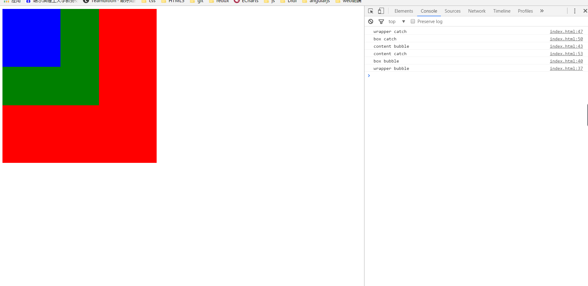
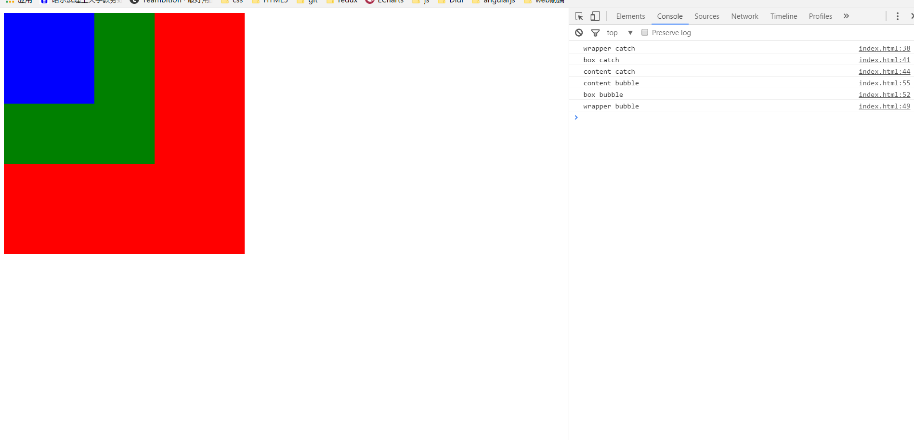
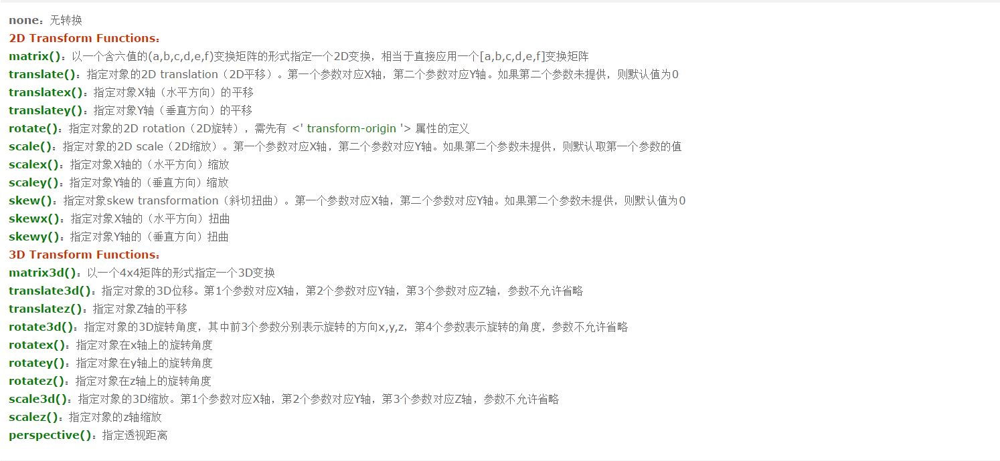
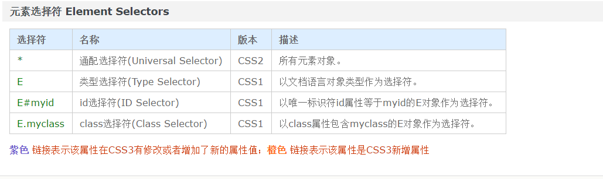
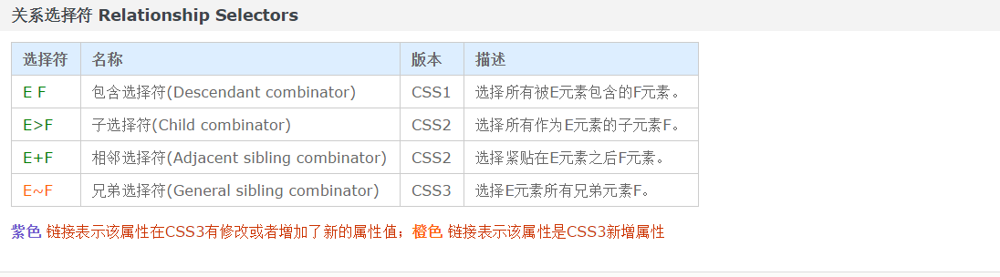
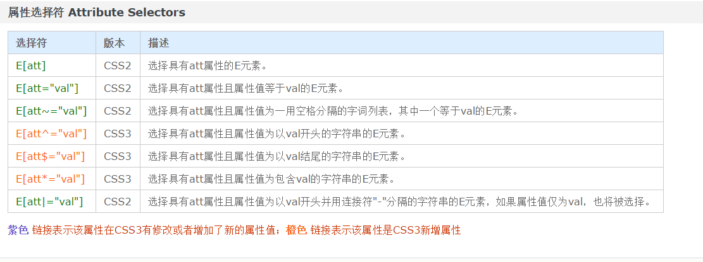
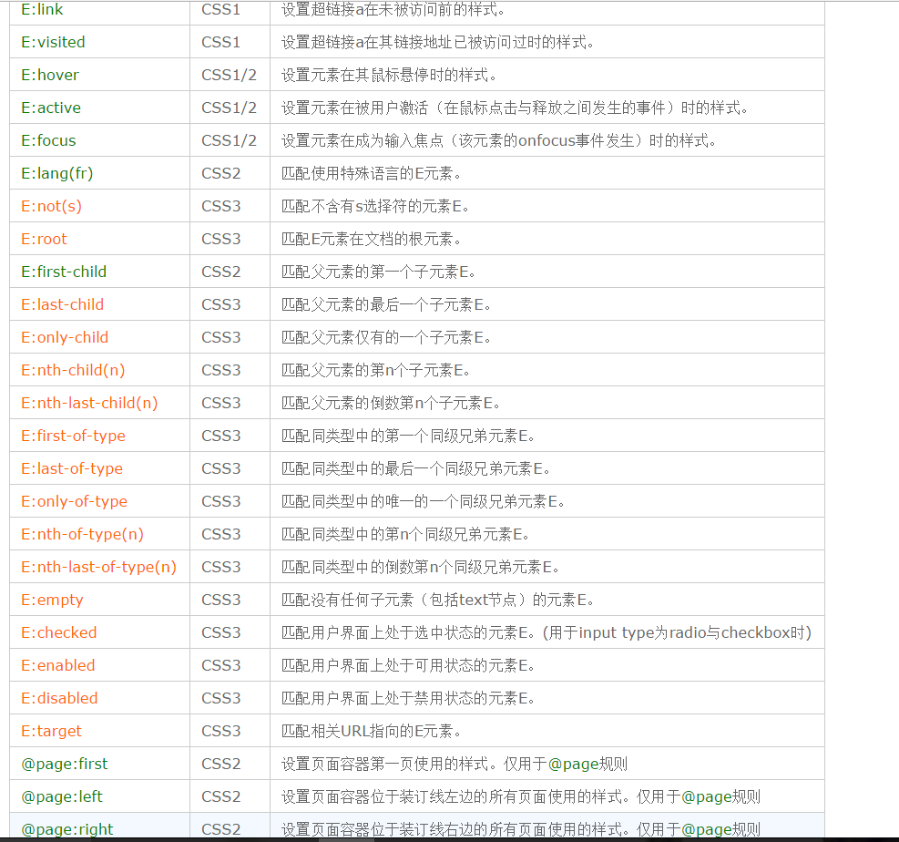
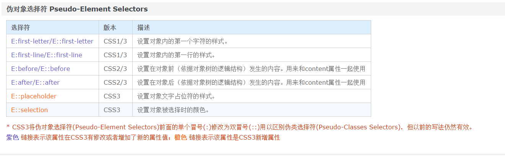

### 面试题目总结

#### 浏览器方面的问题

##### 主流浏览器的内核问题

| 浏览器         | 内核           |
| ------------- |:-------------: |
| IE            | trient         |
| chrome        | webkit         |
| fireFox       | gecko          |
| opera         | presto->blink  |
| safari        | webkit->blink  |

##### 浏览器的两种模式

1. 标准模式：所有浏览器都支持。HTML页面开头有<DOCTYPE html>即此页面为标准模式。
2. 怪异模式：又称为混杂模式。是为了兼容以前老版本浏览器的语法。与标准模式正好相对，HTML页面开头没有<DOCTYPE html>就是混杂模式。
> 可以使用document.compatMode来查看当前页面的模式类型。
标准模式："CSS1Compat"
怪异模式："BackCompat"

##### 针对兼容性问题封装了哪些函数

1. 获取元素的样式getStyle(ele, prop)

```
    function getStyle(ele, prop) {
        if(ele.currentStyle) {//兼容IE
            return ele.currentStyle[prop];
        }else {//getComputedStyle第二个参数可以填写伪元素，这也是唯一获取伪元素样式的方法
            window.getComputedStyle(ele, null)[prop];
        }
    }
```

2. 事件绑定addEvent(ele, type, handle)

```
    function addEvent(ele, type, handle) {
        if(ele.addEventListener) {
            ele.addEventListener(type, handle, false);//第三个参数用来表示是否开启事件捕获，默认开启事件冒泡
        }else if(ele.attachEvent) {
            ele['temp' + type + handle] = handle;
            ele[type + handle] = function () {//将回调函数保存在ele中，用于取消事件
                ele['temp' + type + handle].call(ele); //由于attachEvent的this默认指向window,所以改变this指向ele
            }
            ele.attachEvent('on' + type, ele[type + handle]);
        }else {
            ele['on' + type] = handle;
        }
    }
```

3. 对应绑定事件，取消事件绑定removeEvent(ele, type, handle)

```
    function removeEvent(ele, type, handle) {
        if(ele.removeEventListener) {
            ele.removeEventListener(type, handle, false);
        }else if(ele.detachEvent) {
            ele.detachEvent('on' + type, ele[type + handle]);//使用的是上面封装好的ele[type + handle]函数
        }else {
            ele['on' + type] = null;//false或者''都可以
        }
    }
```
4. 取消冒泡stopBubble(e)

```
    function stopBubble(e) {
        var event = e || window.event;//兼容IE的会将事件传到window.event上面
        if(event.stopPropagation) {
            event.stopPropagation();//IE9 以下版本不兼容
        }else {
            event.cancelBubble = true;//IE独有，现在高版本的浏览器可能也存在
        }
    }
```

5. 阻止默认事件 cancelHandler(e)：表单提交，a标签跳转，右键菜单等

```
    function cancelHandler(e) {
        var event = e || window.event;
        if(event.preventDefault) {//W3C标准
            event.preventDefault();
        }else if(event.returnValue) {
            event.returnValue = false;//兼容IE
        }
    }
```
对于用对象属性方式注册的时间来说，可以return false

```
    document.oncontextmenu = function (e) {//右键菜单失效
        return false;
    }
```


6. 事件源对象：chrome都有下面两个对象属性

* event.target        fireFox独有

* event.srcElement     IE独有

```
    var target = event.target || event.srcElement;
```

7. 封装ajax

```
    function ajax(method, url, data, success) {
        var xhr = null;
        try {
            xhr = new XMLHttpRequest();
        }catch(e) {
            xhr = new ActiveXObject('Microsoft.XMLHTTP');//IE
        }
        if(method == 'get') {
            url += '?' + data;
        }
        xhr.open(method, url, true);//第三个参数为是否开启异步
        if(method == 'get') {
            xhr.send();
        }else if(method == 'post') {
            xhr.setRequestHeader('Content-Type', 'application/x-www-form-urlencoded');//设置请求头部
            xhr.send(data);
        }
        xhr.onreadystatechange = function () {
            if(xhr.readyState == 4) {
                if(xhr.state == 200) {
                    success(xhr.responseText);
                }else {
                    console.log('err');
                }
            }
        }
    }
```

##### 标准的盒子模型与IE的盒子模型

* 标准盒子模型： margin + border + padding + content
这是W3C标准的盒子模型，即box-sizing: content-box(默认)

* IE的盒子模型：margin + content（border + padding + content）。其中content为三个之和，即box-sizing: border-box;

#### HTML和CSS方面的

##### CSS选择器的权重问题

| 选择器            | 权重           |
| -------------    |:-------------: |
| !important       | 无穷大          |
| 行间样式          | 1000           |
| id               | 100            |
| class\|属性\|伪类 | 10             |
| 标签\|伪元素      | 1              |
| 通配符*           | 0              |

##### 消除浮动的方式

* 在外层wrapper上面使用伪元素

```
    .wrapper::after {
        content: '';
        clear: both;
        display: block;//消除浮动必须是block
    }
```

* 将外层wrapper的display变成inline-block

* 将外层的wrapper也float

* 将外层的wrapper里面添加overflow:hidden

* 将外层的wrapper的position设为fixed或者absolute

* 对于IE来说没有伪元素，通过hasLayout出发bfc
``` 
    *zoom: 1;//ie6和ie7
```

```
    _zoom: 1;//只有ie6能识别
```

##### 说一下margin合并和margin塌陷问题

margin合并问题： 当一个元素在另一个元素上面的时候，他们的margin会有重合的部分。可以把他们包裹在一个大的wrapper里面，设置wrapper的overflow为hidden。还可以将这两个元素float一下，但是这样可能会带来上面的问题。

margin塌陷问题：对于父块DIV内含子块DIV的情况，就会按另一条CSS惯例来解释了，那就是：对于有块级子元素的元素计算高度的方式,如果元素没有垂直边框和填充,那其高度就是其子元素顶部和底部边框边缘之间的距离。常用的解决方式：在父级上方添加一个看不到的border或者overflow设置为hidden。

##### 单行文字截断打点

```
    {
        overflow: hidden;
        white-space: nowrap;
        text-overflow: ellipsis;
    }
```
这种设置的兼容性不好，最牛逼的还是强写，就像百度那样。。。

##### 说一说事件冒泡与事件捕获

* 事件冒泡：所有的浏览器都支持。结构上（非视觉上）嵌套关系的元素，会存在事件冒泡的功能，即同一个事件，自子元素冒向父元素（自底向上）

* 事件捕获：只有chrome浏览器支持，只有在addEventListener种开启，自顶向下。一个事件要么事件冒泡，要么事件捕获，不可同时设置。

这个时候可以讲一下下面的例子
```
<!DOCTYPE html>
<html lang="en">
<head>
    <meta charset="UTF-8">
    <meta name="viewport" content="width=device-width, initial-scale=1.0">
    <meta http-equiv="X-UA-Compatible" content="ie=edge">
    <title>Document</title>
    <style>
        #wrapper {
            width: 400px;
            height: 400px;
            background-color: red;
        }        
        #box {
            width: 250px;
            height: 250px;
            background-color: green;
        }
        #content {
            width: 150px;
            height: 150px;
            background-color: blue;
        }
    </style>
</head>
<body>
    <div id="wrapper">
        <div id="box">
            <div id="content"></div>
        </div>
    </div>
    <script>
        var wrapper = document.getElementById('wrapper'),
            box = document.getElementById('box'),
            content = document.getElementById('content');
        wrapper.addEventListener('click', function () {
            console.log('wrapper bubble');
        }, false);
        box.addEventListener('click', function () {
            console.log('box bubble');
        }, false);
        content.addEventListener('click', function () {
            console.log('content bubble');
        }, false);

        wrapper.addEventListener('click', function () {
            console.log('wrapper catch');
        }, true);
        box.addEventListener('click', function () {
            console.log('box catch');
        }, true);
        content.addEventListener('click', function () {
            console.log('content catch');
        }, true);

    </script>
</body>
</html>
```
当点击content的时候


大家看第三行和第四行，有点搞不清楚。我们将代码变换一下

```
<script>
        var wrapper = document.getElementById('wrapper'),
            box = document.getElementById('box'),
            content = document.getElementById('content');
        
        wrapper.addEventListener('click', function () {
            console.log('wrapper catch');
        }, true);
        box.addEventListener('click', function () {
            console.log('box catch');
        }, true);
        content.addEventListener('click', function () {
            console.log('content catch');
        }, true);


        wrapper.addEventListener('click', function () {
            console.log('wrapper bubble');
        }, false);
        box.addEventListener('click', function () {
            console.log('box bubble');
        }, false);
        content.addEventListener('click', function () {
            console.log('content bubble');
        }, false);


    </script>
```
再看一下结果


代码调换一下之后，其余没有变，但是第三行和第四行的执行顺序变了。

由此，我们可以知道，无论是事件捕获还是事件冒泡，都不是针对自己的，都是针对父级或者子元素。绑在自身的事件叫做事件执行。
执行顺序：先捕获，然后自身事件执行，最后冒泡


#### javascript方面的

##### 说一下闭包问题

每一个javascript函数都是一个对象，它在每一次执行的时候都会生成一个独一无二的执行期上下文，并且在函数执行完毕之后就释放这个资源，即外部环境是无法访问函数内部的成员。闭包就是函数内部的部分资源占着内存没有释放，导致外部可以访问这部分资源。闭包会导致内存泄漏。闭包既有优势又有劣势，但是总体来说劣势大于优势，所以要避免使用。但是也有很多的好处，例如jquery就是利用了闭包的特点。（下面开始吹jquery）

jquery本身就是一个立即执行函数，它利用了闭包的优势，将自己的成员变量$挂在到了window上面，这样即使立即执行函数执行完毕之后，仍然能够访问到$。
jquery最大的特点就是将所有的成员变量即方法写到了立即执行函数的参数里面。其中主函数只是把参数的factory函数执行一下。
在factory函数中首先定义了jquery的初始化函数，这个函数只是调用了jquery.fn.init方法而已。所以绝大部分的方法是在jquery.fn.init中定义的。而jquery.fn = jquery.prototype,也就是说jquery中调用的函数就是其父级上上面的函数。jquery中y偶jquery.fn.prototype = jquery.fn,也就是说在父级的init函数中又把它的父级指向了jquery的父级，这样的话jquery.prototype可以访问init函数，而jquery.prototype.init.prototype又指向了jquery.prototype,这样就是无线循环的指向了。(同学们可以输出jquery.prototype看一下)。
自己也可以仿照jquery的这种格式写自己的"jquery",我就暂且命名为xquery了
```
    (function (global, factory) {
        factory(global);
    } (window, function (window) {
        var xquery = function () {
            return new xquery.fn.init();
        }
        xquery.fn = xquery.prototype;
        var init = xquery.fn.init = function () {
            return {
                name: 'xujian',
                test: function () {
                    console.log('I am xquery');
                }
            }
        }   
        init.prototype = xquery.fn;
        window.$ = window.xquery = xquery();
        return xquery;
    }));
```
以上就是jquery对闭包的应用(可以吹个3分钟吧)，如果面试官没有问题jquery的问题，那你可以继续吹嘛。

（意犹未尽的脸）当然在编程中还是要注意闭包问题，比如最经典的闭包问题就是一个数组（假设10个），每个元素绑定一个function,要求输出他们的index值，最后执行的时候发现输出了10个10。这个就是闭包带来的。

```
    function retB() {
        var arr = [];
        for(var i = 0; i < 10; i ++) {
            arr[i] = function () {
                console.log(i);
            }
        }
    }
    var testArr = retB();
    for(var j = 0; j < testArr.length; j ++) {
        testArr[i]();//输出10 个 10
    }
```
造成这种现象的原因就是数组中的每个元素要访问原来函数中的i只，经过一番循环之后，i已经变成了10，所以会输出10个10。解决的方法就是把下面这段代码换掉

```
    arr[i] = function () {
        console.log(i);
    }
    换成
    arr[i] = (function (n) {
        console.log(n);
    } (i));
```
或者使用es6中的let

```
    for(let i = 0; i < 10; i ++) {
        arr[i] = function () {
            console.log(i);
        }
    }
```
到这里的话闭包就讲的差不多了，下面就刚才这个例子继续给他将[预编译](#preview-compile)的过程，或者讲[es6](#es6)。

##### <a id="preview-compile"/>预编译

js文件在执行之前，要经过一个预编译的过程。预编译的过程分成四个步骤：
1. 创建AO对象

2. 找形参和变量声明，将变量和形参名作为AO对象的属性名，值为undefined

3. 将实参与形参统一

4. 找函数声明，值赋值为函数体

这就是为什么在js文件中，有些变量在文件后面声明，但是在文件前部访问的时候不报错而且值为undefined。从中可以得出，函数声明提升是整体提升（值为函数体），而变量声明提升是局部提升（即值为undefined）

##### 包装类


为了便于操作基本类型值，ECMAScript 提供了 3 个特殊的引用类型：Boolean、Number和 String。这些类型与其他引用类型相似，但同时也具有与各自的基本类型相应的特殊行为。实际上，每当读取一个基本类型值的时候，后台就会创建一个对应的基本包装类型的对象，从而能够调用一些方法来操作这些数据。
但是自定义的成员在使用完毕之后就会被销毁

```
    var str = 'abcd';
    str.leng = 4;//使用完毕之后就会被销毁
    console.log(str.leng);//undefined
```

##### 说一说原型

javascript语言没有向c，java那样的继承机制，要想体现这一思想，只有原型。当一个对象调用某个成员变量或者方法的时候，它首先会在自身的作用域中查找对应的成员，如果找到就做出相应操作并且返回。如果没有找到，会去它的原型上面找，原型还可能又原型，只要找到该成员方法就返回，多个原型构成了像一条链一样构成了原型链。绝大多数的对象最终都会继承自Object.prototype

继承的发展大概有这么四种，也是四个发展的阶段
1. 传统形式就是有什么继承什么。这样会继承太多没用的属性。

2. 借用构造函数。严格来说，这个根本不算是继承，它只是借用别人的函数来实现一些功能。这样不能继承借用构造函数的原型，而且每次构造函数都要多走一个函数。
```
    function Foo(name, age) {
        this.name = name;
        this.age = age;
    }
    function Son(name, age) {
        Foo.call(this, name, age);
    }
    var son = new Son('xujian', 21);//{name: 'xujian", age: 21}
```

3. 共享原型：一个函数共享另一个函数的原型，这样如果通过自身的函数改变了改原型的变量，则继承改原型的函数原型当然也就改变。

4. 加中间层（圣杯模式）：针对第三种方法的缺陷，加一个中间层就可以杜绝。
```
    var inherit = (function () {
        var F = function () {}
        return function (P, C) {
            F.prototype = P.prototype;
            C.prototype = new F();
            C.constructor = C;//构造函数设置为C
            C.uber = P;//超类设置为P
        }
    } ())
```

##### 数组去重问题

不多说，直接上代码

```
    Array.prototype.unique = function () {//原型链编程
        var obj = {};
        var arr = [];
        var len = this.length;
        for(var i = 0; i < len; i ++) {
            if(obj[this[i]] != 1) {
                arr.push(this[i]);
                obj[this[i]] == 1;
            }
        }
        return arr;
    }
```
这里采用的是原型链上编程，可以使所有的数组都可以使用这个方法，这也是原型链编程的一大好处。

#### h5方面的问题

1. canvas：画布

canvas画出来的图是位图，位图在放大之后会失真；与之相对应的就是svg的矢量图，即无论如何放大都不会失真（如丝般顺滑）。
使用的时候就是一个canvas标签，也可以通过js来创建该元素。可以指定width和height，默认的width：300，height：150。我们如果想要开始画图，必须获取它的上下文对象(画笔)

> var ctx = canvas.getContext('2d');

之所以不是3d，是因为如果是3d就是webgl（这里不做多的解释）。常见的一些用法如下：

* beginPath()
* moveTo()
* stroke()
* fill()
* closePath()

还有一些高级的用法：

* strokeRect(x, y, dx, dy)
* fillRect(x, y, dx, dy)
* clearRect(x, y, dx, dy):常用来擦出当前区域
* arc(x, y, r, 起始弧度, 结束弧度, 弧形方向)：绘制弧形，弧形方向0为顺时针，1为逆时针

其中要特别说明的一些方法：
* drawImage():共有三种三种参数形式，第一个参数都是img(image,video, canvas)
3个参数：drawImage(img, x, y)会将img整个截取，从(x, y)的点开始放置；5个参数：drawImage(img, x, y, dx, dy)会将img整个截取，放置到Rect(x, y, dx, dy)的矩形中去；9个参数：drawImage(img, x1, y1, dx1, dy1, x2, y2, dx2, dy2)会从img上截取Rect(x1, y1, dx1, dy1)的矩形图样放置到Rect(x2, y2, dx2, dy2)的矩形区域。

* toDataURL()：将canvas的内容抽取成一张图片，是canvas自身的方法，不是ctx的。（注意同源策略）的限制

* 获取canvas的像素信息：getImageData(x, y, dx, dy),createImageData(w, h), putImageData(d, x, y)

canvas的简单介绍就到这里了。

2. svg相关问题

正如上面提到的，svg是矢量图，也可以设置宽高。与canvas的不同是，svg所有的操作都是在html页面中的，不需要js。常见的标签：

* 直线：
```
    <line x1="10" y1="10" x2="20" y2="20"></line>
```

* 矩形： 
```
    <rect x="50" y="50" width="100" height="100" rx="10" ry="20"></rect>//rx与ry是用来设置border-radius
```

* 原形：
```
    <circle r="50" cx="200" cy="200"></circle>
```

* 椭圆：
```
    <ellipse rx="100" ry="50" cx="200" cy="200"></ellipse>
```

* 折线：
```
    <polyline points="60 50, 75 35, 100 50, 125, 35"></polyline>
```

* 多边形：
```
    <polygon points="125 125, 130 140, 120 140"></polygon>
```

* 文本
```
    <text x="125" y="220">Hello World</text>
```

* 里面还有一种万能的：
```
    <path d="M 10 10 L 20 10"/>
    /*
        指令m,l,h,v都有大小写，大写为绝对坐标，小写为相对坐标
        1.M指令和L指令：类比canvas的moveTo和lineTofangfa
        2.H指令和V指令：水平移动和竖直移动
        3.z指令（不区分大小写）：返回起点
        4.A指令：七个参数 rx ry 圆弧相对于x轴旋转角度 大小圆弧（1表示大） 顺逆时针（1表示顺时针与canvas的arc不同） x y
                rx,ry表示圆弧x轴的半径和y轴半径
                x,y表示终点坐标
    */
```

svg的简单介绍就到这里了

3. requestAnimationFrame和cancelAnimationFrame

我们浏览器都有一个最短的刷新周期，也就是说在周期中页面任何变化必须等到下一个周期才能体现，大概是16ms。我们有两个函数setInterval和setTimeout，如果我们把定时器的时间预定的太小，小于它的最小周期，则不能正常运行。
requestAnimationFrame就是解决这个问题的，它根据不同的浏览器，将定时定位该周期，与setTimeout相似。
```
    var id = requestAnimationFrame(function () {//只会执行一次，与setTimeout相似
        console.log('hi');
    });
    cancelAnimationFrame(id);//取消
```

4. video与audio方面的

是h5新加的标签，我们以前如果在页面中插入视频的话需要借助于flash，前端的代码也是一大堆，现在有了video只需要一行代码就能够搞定了。
```
    <audio src="资源链接" autoplay controls loop></audio>
    <video src="资源链接" autoplay controls post="代替的图片"></video>
```

5. cookie,localStorage和sessionStorange

* cookie: cookie添加在请求首部的一些消息，所以通常大小不能太大，大概就是4k左右，而且只能采用get请求，存在与客户的硬盘中，可以设置过期时间，仅同一域名下的网站能访问。典型的应用就是服务器判断用户是否登录，因为浏览器http请求是无状态的，所以服务器要想判断用户的状态只能通过cookie。关于浏览器如何根据cookie判断用户登录状态的，访问[使用cookie做用户登录的过程详解](http://blog.csdn.net/looksunli/article/details/9799395)。还有一个应用就是购物车，在localStorage没出来之前，都是用cookie保存商品信息，localStorage出来后也算是解放了cookie。
* localStorage：存在于用户的硬盘中，大小约为5M，必须手动删除，否则永远存在，所有网站都能访问。
* sessionStorage：仅是当前页面可以使用，退出后删除，用的较少。

6. history

* forward(),back(),go()
* pushState(state, title, url),replaceState(state, title, url)
* 事件：popstate当状态返回的时候；hashchange当hash值改变的时候触发。

7. 地理位置：
window.navagator.geolocation的对象：
* getCurrentPosition(success, error, options)
success为成功的回调函数，error为失败的回调函数，options可以设置超时时间(timeout)以及最大的数据过期时间（maximumAge）等
* watchPosition(s, e, o)
* clearWatch(id)

8. web离线应用
必须在html文件指明后缀名为.appche的文件，文件中一共分成三个部分，一部分是缓存的，一部分是绝对不能缓存的，最后一部分是离线之后转到的页面通常为404错误页面

9. worker

js为单线程的语言，当页面有大量运算进行的时候，会阻塞页面，造成页面的交互都停止。worker就是将这部分运算替主线程完成，最终返回给主线程，这样就不会阻塞页面了。

#### CSS3方面的

这个方面的面试官一般不好问，要么给你个情景让你实现效果，要么就直接问你效果，主要掌握几个css新增属性就可以了。具体的效果展示，参考[css参考手册](http://www.css88.com/book/css/)。

1. 盒子模型（flex新）
* flex-grow:指定扩展比率，默认为1。
* flex-shrink: 指定收缩比率，默认为1。
* flex-basis: 指定伸缩的基准值，当与width发生冲突的时候，取flex-basis。
* flex-direction: 决定flex需要如何排列（row|row-reverse|column|column-reverse）
* flex-wrap: 单行或者多行（nowrap|wrap|wrap-reverse）
* align-content: 多行文本对齐方式（flex-start|flex-end|center|space-between|space-around|stretch）
* align-items: 子项的纵向对齐方式（flex-start|flex-end|center|baseline|stretch）
* align-self: 定义flex子项单独在侧轴（纵轴）方向上的对齐方式。
* justify-content:（横轴）方向上的对齐方式(flex-start| flex-end|center|space-between|space-around)
* order: 设置或检索弹性盒模型对象的子元素出現的順序。

2. transform变换
* transform:

* transform-origin: 设置或检索对象以某个原点进行转换。(默认为50% 50%也就是center)
* transform-style: 指定某元素的子元素是（看起来）位于三维空间内，还是在该元素所在的平面内被扁平化。(flat(默认)|preserve-3d)
* perspective 景深

3.transition过渡

* transition: property duration timing-function delay 
```
取值：
    <'transition-property '>：检索或设置对象中的参与过渡的属性
    <'transition-duration '>：检索或设置对象过渡的持续时间
    <'transition-timing-function '>：检索或设置对象中过渡的动画类型
    <'transition-delay '>：检索或设置对象延迟过渡的时间
```

4. animation动画
* animation: name duration timing-function delay iteration-count direction fill-mode play-state
```
<'animation-name'>：检索或设置对象所应用的动画名称
<'animation-duration'>：检索或设置对象动画的持续时间
<'animation-timing-function'>：检索或设置对象动画的过渡类型
<'animation-delay'>：检索或设置对象动画延迟的时间
<'animation-iteration-count'>：检索或设置对象动画的循环次数
<'animation-direction'>：检索或设置对象动画在循环中是否反向运动
<'animation-fill-mode'>：检索或设置对象动画时间之外的状态
<'animation-play-state'>：检索或设置对象动画的状态。w3c正考虑是否将该属性移除，因为动画的状态可以通过其它的方式实现，比如重设样式
```
5. 选择器
* 元素选择器


* 关系选择器


* 属性选择器


* 伪类选择器


* 伪元素选择器



